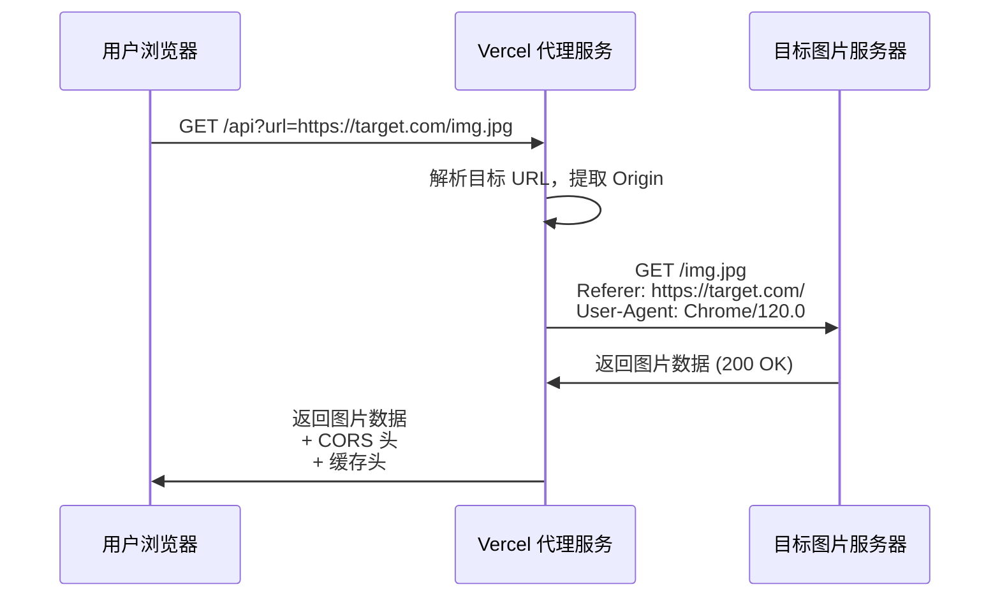

# 🖼️ Image Proxy Service

一个部署在 Vercel 上的轻量级图片代理服务，用于绕过防盗链保护（Hotlink Protection），让你可以在自己的网站上自由引用第三方图片资源。

## 📋 项目背景

当你在博客或网站上引用第三方论坛（如 52pojie.cn、V2EX 等）的图片时，经常会遇到 **403 Forbidden** 错误。这是因为这些网站启用了防盗链保护，会检查请求的 `Referer` 头。

本项目通过 Serverless 函数作为中间代理层，伪造合法的请求头去获取图片，然后将图片数据返回给你的网站，完美解决防盗链问题。

## ✨ 核心特性

- ✅ **防盗链破解**：自动设置正确的 `Referer` 和 `User-Agent`
- ✅ **零依赖**：使用 Node.js 原生 `fetch` API，无需第三方库
- ✅ **CORS 支持**：允许跨域访问，可在任何前端项目中使用
- ✅ **智能缓存**：浏览器缓存 + Vercel 边缘缓存，减少带宽消耗
- ✅ **错误处理**：完善的异常捕获和错误提示
- ✅ **Serverless**：基于 Vercel Functions，自动扩展，按需付费

## 🚀 快速开始

### 1. 部署到 Vercel

#### 方法 A：一键部署（推荐）

点击下方按钮，一键部署到你的 Vercel 账号：

[](https://vercel.com/new/clone?repository-url=https://github.com/jinlong5201314/image-proxy)

#### 方法 B：通过 Vercel Dashboard

1. Fork 本仓库到你的 GitHub 账号
2. 访问 [Vercel Dashboard](https://vercel.com/new)
3. 选择 "Import Git Repository"
4. 选择你 Fork 的 `image-proxy` 仓库
5. 点击 "Deploy"（��需修改任何配置）

#### 方法 C：通过 Vercel CLI

```bash
# 克隆仓库
git clone https://github.com/jinlong5201314/image-proxy.git
cd image-proxy

# 安装 Vercel CLI（如果还没有）
npm install -g vercel

# 部署
vercel --prod
```

### 2. 获取你的代理域名

部署成功后，Vercel 会分配一个域名，例如：
```
https://image-proxy-xxx.vercel.app
```

你也可以在 Vercel Dashboard 中绑定自定义域名。

## 📖 使用方法

### 基本用法

将原始图片 URL 作为 `url` 参数传递给代理服务：

```
https://your-domain.vercel.app/api?url=<目标图片URL>
```

### 实际示例

**原始图片（会 403）：**
```
https://avatar.52pojie.cn/images/noavatar_middle.gif
```

**通过代理访问：**
```
https://your-domain.vercel.app/api?url=https://avatar.52pojie.cn/images/noavatar_middle.gif
```

### 在 HTML 中使用

```html
<!-- 原始方式（会失败） -->


<!-- 使用代理（成功） -->

```

### 在 Markdown 中使用

```markdown

```

### 在 JavaScript 中使用

```javascript
const originalUrl = 'https://avatar.52pojie.cn/images/noavatar_middle.gif';
const proxyUrl = `https://your-domain.vercel.app/api?url=${encodeURIComponent(originalUrl)}`;

// 使用代理 URL
document.getElementById('myImage').src = proxyUrl;
```

## 🔧 技术架构

### 技术栈

- **运行环境**：Node.js 18+ (Vercel Serverless Functions)
- **语法规范**：ES Modules
- **HTTP 客户端**：原生 `fetch` API
- **部署平台**：Vercel

### 项目结构

```
image-proxy/
├── api/
│   └── index.js          # 核心代理逻辑
├── package.json          # 项目配置
├── .gitignore           # Git 忽略规则
└── README.md            # 项目文档
```

### 工作原理



### 核心功能实现

1. **防盗链破解**
   - 动态解析目标 URL 的 `Origin`
   - 设置 `Referer` 为目标域名（如 `https://52pojie.cn/`）
   - 使用真实浏览器 `User-Agent`

2. **性能优化**
   - 浏览器缓存：`Cache-Control: public, max-age=86400`（1天）
   - Vercel 边缘缓存：`CDN-Cache-Control: public, max-age=86400`
   - 过期重验证：`stale-while-revalidate=43200`（12小时）

3. **CORS 支持**
   - `Access-Control-Allow-Origin: *`
   - `Access-Control-Allow-Methods: GET, OPTIONS`

## ⚙️ 配置说明

### 修改缓存时长

编辑 `api/index.js`，找到以下代码：

```javascript
// 缓存控制 - 1天 (86400秒)
res.setHeader('Cache-Control', 'public, max-age=86400, s-maxage=86400, stale-while-revalidate=43200');
```

修改 `max-age` 值（单位：秒）：
- `3600` = 1小时
- `86400` = 1天
- `604800` = 7天

### 自定义域名

1. 在 Vercel Dashboard 中进入你的项目
2. 点击 "Settings" → "Domains"
3. 添加你的自定义域名（如 `img-proxy.yourdomain.com`）
4. 按照提示配置 DNS 记录

## 🛡️ 安全性说明

### 使用限制

- 本服务仅用于合法的图片引用场景
- 请遵守目标网站的服务条款和 robots.txt
- 不建议用于大规模爬虫或商业用途

### Vercel 限额

Vercel 免费计划的限制：
- **带宽**：100 GB/月
- **函数调用**：100 GB-小时/月
- **函数执行时间**：10秒/次

如果超出限额，建议升级到 Pro 计划或使用其他 Serverless 平台。

## 🐛 常见问题

### Q1: 为什么有些图片还是加载失败？

**可能原因：**
- 目标网站使用了更复杂的反爬机制（如 IP 限制、验证码）
- 图片 URL 已失效
- 目标服务器响应超时（Vercel 函数限制 10 秒）

**解决方案：**
- 检查原始 URL 是否可以在浏览器中直接访问
- 查看 Vercel 函数日志排查具体错误

### Q2: 如何查看错误日志？

1. 访问 [Vercel Dashboard](https://vercel.com/dashboard)
2. 进入你的项目
3. 点击 "Functions" 标签
4. 查看函数调用日志

### Q3: 可以代理视频或其他文件吗？

理论上可以，但不推荐：
- Vercel 函数有 10 秒执行时间限制
- 大文件会消耗大量带宽
- 建议仅用于图片代理

### Q4: 如何限制访问来源？

编辑 `api/index.js`，修改 CORS 头：

```javascript
// 只允许特定域名访问
res.setHeader('Access-Control-Allow-Origin', 'https://yourblog.com');
```

## 📊 性能优化建议

1. **使用 CDN**：绑定自定义域名并启用 Cloudflare CDN
2. **延长缓存**：根据图片更新频率调整 `max-age`
3. **图片压缩**：在代理层添加图片压缩逻辑（需引入 sharp 等库）
4. **批量预加载**：对常用图片进行预加载

## 🤝 贡献指南

欢迎提交 Issue 和 Pull Request！

### 本地开发

```bash
# 克隆仓库
git clone https://github.com/jinlong5201314/image-proxy.git
cd image-proxy

# 安装 Vercel CLI
npm install -g vercel

# 本地开发
vercel dev

# 访问 http://localhost:3000/api?url=<图片URL>
```

### 提交规范

- `feat`: 新功能
- `fix`: 修复 Bug
- `docs`: 文档更新
- `perf`: 性能优化
- `refactor`: 代码重构

## 📄 开源协议

本项目采用 [MIT License](LICENSE) 开源协议。

## 🙏 致谢

- [Vercel](https://vercel.com) - 提供优秀的 Serverless 平台
- [Node.js](https://nodejs.org) - 强大的 JavaScript 运行时

## 📮 联系方式

- **GitHub Issues**: [提交问题](https://github.com/jinlong5201314/image-proxy/issues)
- **GitHub Discussions**: [参与讨论](https://github.com/jinlong5201314/image-proxy/discussions)

---

⭐ 如果这个项目对你有帮助，欢迎 Star 支持！
